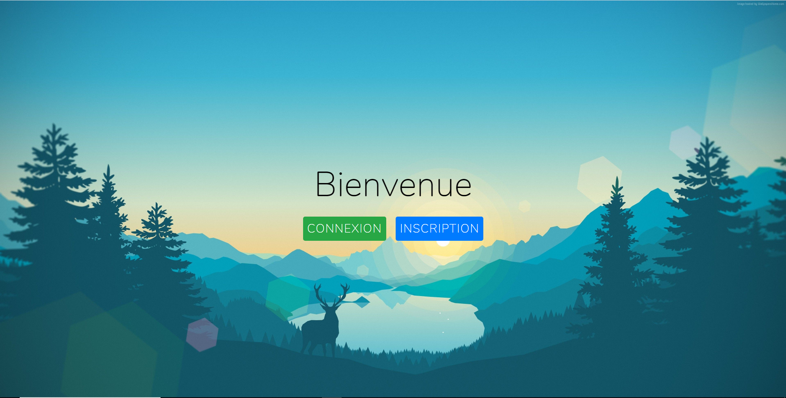
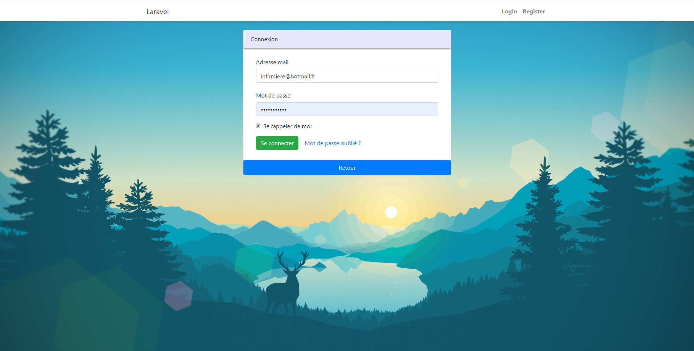
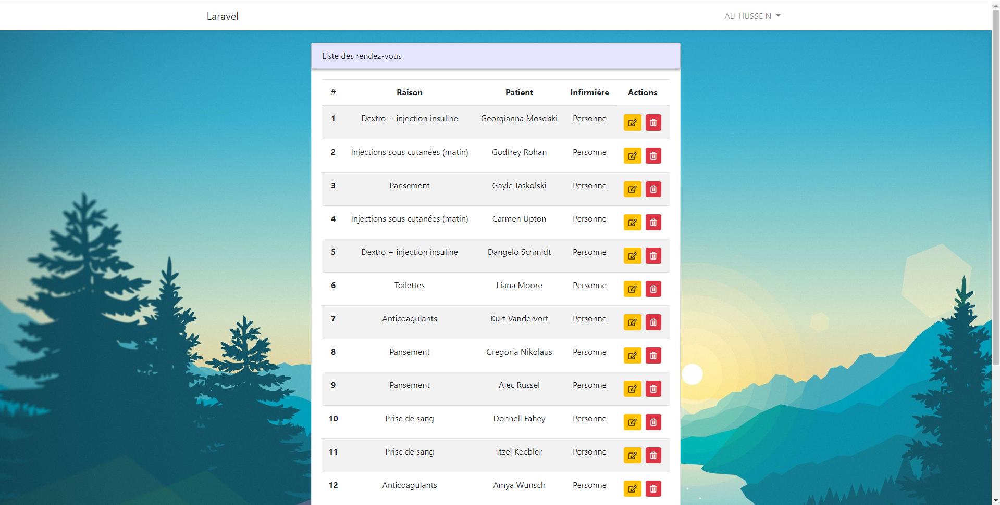
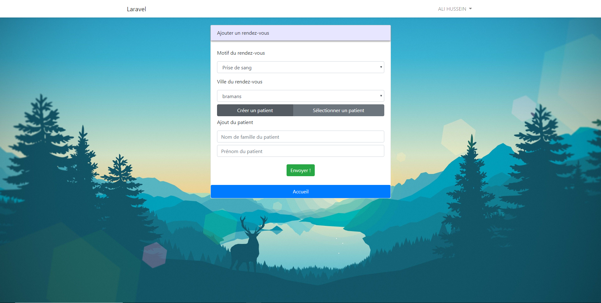
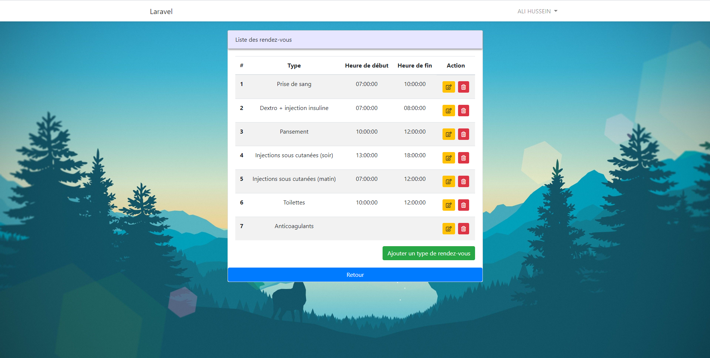
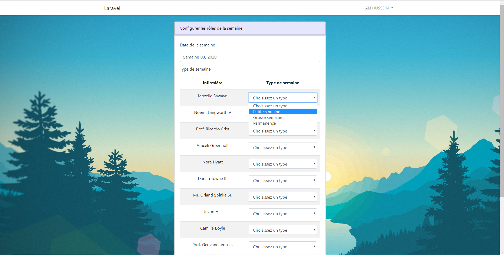
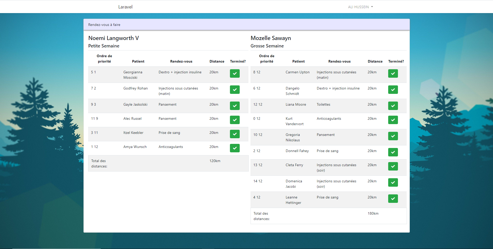

## Introduction du projet

Le projet fait référence à notre projet tutoré de DUT Informatique.
Il s'agit d'un cas réel dans lequel un cabinet d'infirmière cherche un moyen d'optimiser et de simplifier la gestion, l'ordre, la modification, et l'organisation générale du cabinet et des rendez-vous, en vue d'avoir une meilleure coordination globale.

## Comment fonctionne l'application

L'idée est de réaliser une application Web grâce à laquelle chaque infirmière peut accéder à son interface, saisir les rendez-vous qu'elle doit réaliser,  les contraintes liées à ce rendez-vous, et ainsi mieux gérer ces derniers dans la semaine.

Puisque toutes les infirmières possèdent chacune des horaires spécifiques (travail seulement matin, ou matin/après-midi, parfois Week-end, etc...), il faut également prendre en compte ces contraintes.

De plus, les types des rendez-vous imposent des contraintes de temps selon leur caractéristiques (les prises de sang ne doivent être réalisées que le matin par exemple, de même pour les toilettes qui possèdent une limite de temps).

Une fois tous les rendez-vous de toutes les infirmières travaillant le lendemain insérés, un algorithme s'occupe de gérer la répartition de ces derniers pour chaque infirmière en cherchant à optimiser au maximum les trajets qu'elles effectueront (selon la localisation de chaque rendez-vous et les contraintes liées à ceux-ci).

## Stade d'avancement du projet

Le projet n'ayant pour vocation de n'être qu'une première ébauche de ce à quoi ressemblerait une telle application fonctionnelle, le groupe réalisant ce projet s'est chargé d'implémenter en priorité toutes les fonctionnalités les plus essentielles soumises par les infirmières lors de la réalisation du cahier des charges, à savoir:

• Page d'accueil actuelle:

• Possibilité de s'inscrire/se connecter pour une infirmière.

• Gérer les rendez-vous (créer, voir, supprimer, éditer, modifier certains éléments spécifiques, changer le type).

`Liste des rendez-vous:`

`Créer un rendez-vous:`

• Pouvoir gérer les motifs de rendez-vous spécifiques (Prise de sang, toilettes, définir les horaires maximum, etc...).

• Pouvoir éditer/modifier/supprimer ces types selon les législations relatives (définies selon le code national de ce type de rendez-vous).

• Gestion de l'affichage des rendez-vous d'une infirmière de tournée pour un jour/semaine donnée.
`Ici on configure la semaine des infirmières (petite/grosse semaine ou permanence selon les horaires qu'elles définissent elles-mêmes)`:

• Mise en place de la base de données et des migrations nécessaires.

• Implémentation d'une première version de l'algorithme de répartition prenant en compte les infirmières en tournée pour le jour suivant 
selon les rendez-vous à effectuer.
`L'algorithme réalisé va affecter à chaque infirmière travaillant pour une journée donnée l'ordre des rendez-vous à effectuer (+ calcul des distances):`

• Point important: la charte graphique et l'ergonomie du site avait pour condition d'être intuitive et facile d'utilisation pour un groupe d'infirmières novices en informatique. Bien que la version actuelle n'ait pas pour vocation d'être déployée, la charte graphique fut mise en place par Ali Hussein (front-end), en vue d'avoir une idée globale de l'ergonomie voulue par les infirmières.
    
## Membres du groupe

Ce projet fut réalisé par un groupe d'étudiants à l'IUT Informatique Lyon 1:

    HUSSEIN Ali
    
    DO ESPIRITO SANTO Valentin
    
    MACE Lucas
    
    PEREZ Hugo
    
    SERPOLLIER Rémi
    
    
Rédaction: HUSSEIN Ali.
    
    
